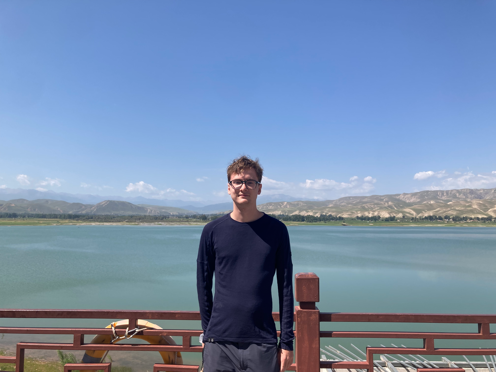

---
hide:
  - toc
  - navigation
---
<!--
CHECKLIST FOR THIS PAGE:
- [ ] Replace [YOUR NAME] with your full name (3 places)
- [ ] Replace [YOUR JOB TITLE] with your current or target role
- [ ] Replace [YOUR TAGLINE] with a short phrase describing your focus
- [ ] Rewrite the About Me paragraph with your own words
- [ ] Replace assets/images/profile.png with your actual photo (keep the filename or update it below)
- [ ] Replace assets/images/about.png with your own image (a field photo, map, or workspace shot)
- [ ] Edit the skill cards to match your actual skills (add, remove, or rename cards as needed)
- [ ] Update GitHub and LinkedIn links in the Connect section
- [ ] Add your CV PDF to docs/assets/ and update the filename in the Download CV button
-->

  
  <h1>Thomas GELGON</h1>
  
<strong>Msc in Urban Project second year student - Université Paul Valéry, Montpellier</strong>

  
<em> Urban Planning / Territorial analysis / GIS / PAO </em>

---

## About Me

I am an urban planning student specializing in peri-urban towns development with a background in physical geography and environnement.
I provide territorial diagnosis and actionable recommendations to local governments related to their economic development, environment protection and urban renewal.
I use QGIS and other open-source GIS tools, Adobe Creative Suites and R for statistical analysis. I am currently seeking internship opportunities in Urban Planning.

  

---

[View My Projects :material-arrow-right:](projects/index.md){ .md-button .md-button--primary }
[Download CV :material-download:](assets/Thomas_GELGON_CV.pdf){ .md-button }

---

## Skills

-   :material-layers:{ .lg .middle } **GIS & Cartography**

    ---

    - QGIS
    - Magrit

-   :material-code-braces:{ .lg .middle } **Programming**

    ---

    - R — terra, ggplot2
   

-   :material-star-four-points:{ .lg .middle } **Communication skills**

    ---

    - Public consultations
    - Community Project leadership
    - Cross-cultural geographical analysis
    
 

 

-   :material-earth:{ .lg .middle } **Territorial Analysis**

    ---

    - Statistical surveys and representation
    - Urban Morphology analysis
    - Environemental assessment
    - Planning documents analysis & Regulatory urban planning

-   :material-database:{ .lg .middle } **Data**

    ---

    - Large database analysis with Excel
    - Data formats: GeoJSON, GeoTIFF, GPKG

-   :material-airplane:{ .lg .middle } **Drone**

    - Mission planning and flight operations

---

## Connect

[GitHub](https://github.com/thomasgelgon){ .md-button }
[LinkedIn](https://linkedin.com/in/[YOUR-LINKEDIN-USERNAME]){ .md-button }
