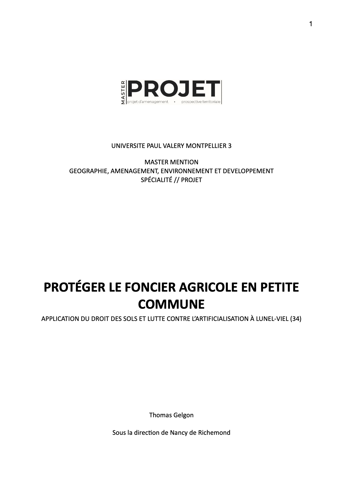
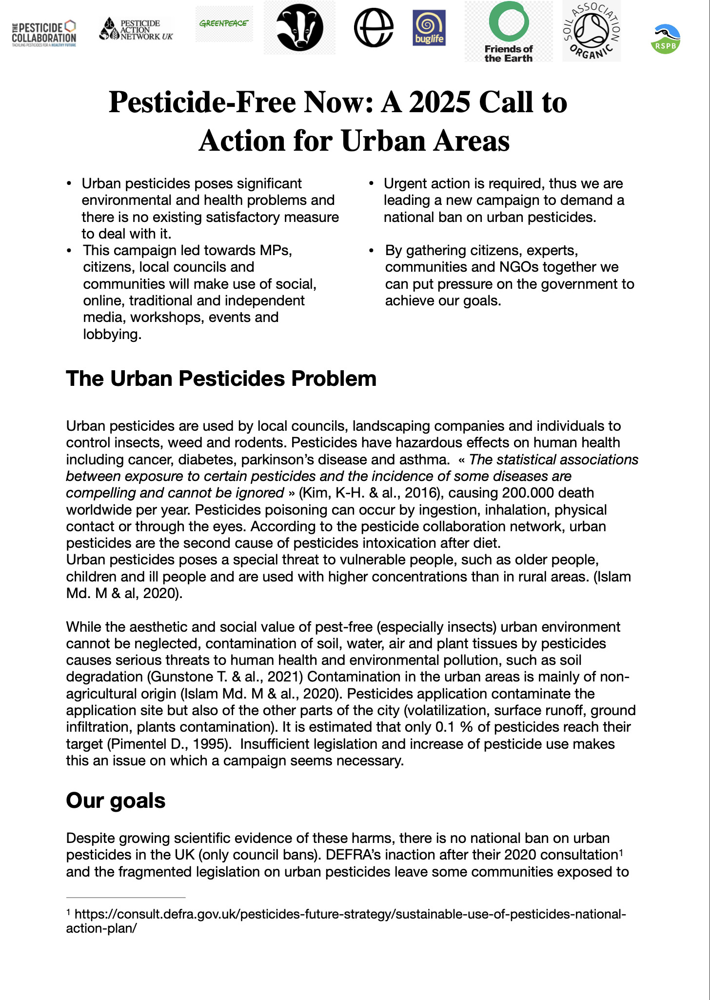
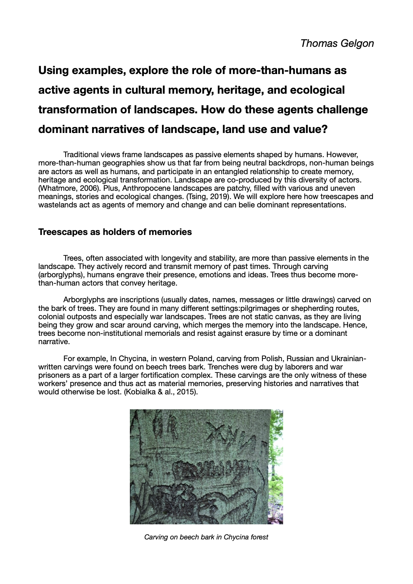
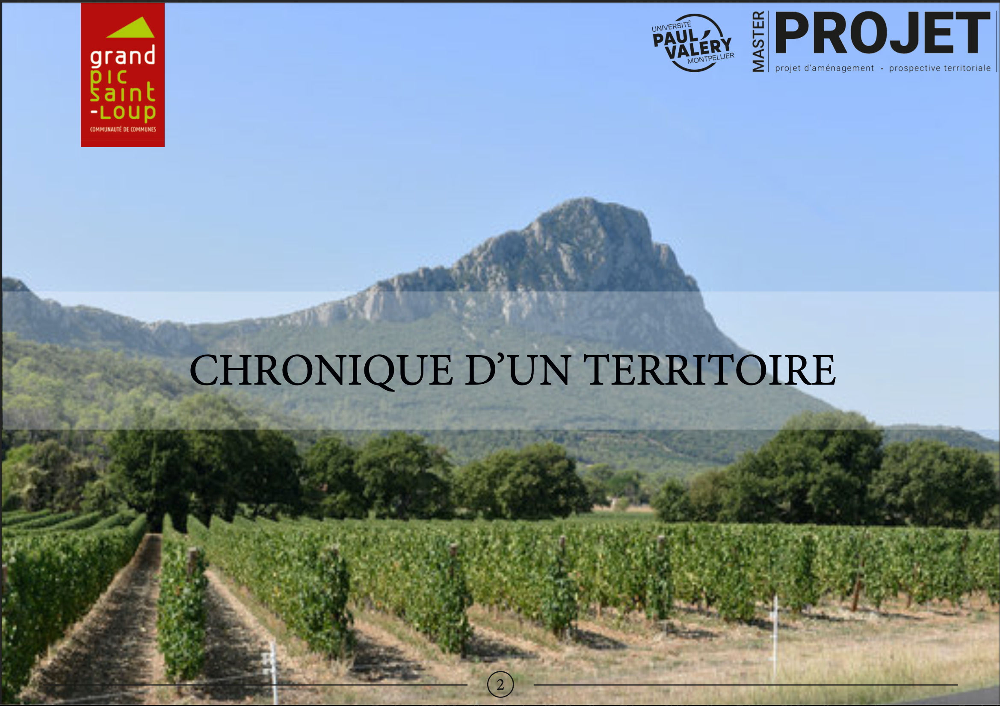

---
hide:
  - toc
  - navigation
---
<!--
CHECKLIST FOR THIS PAGE:
- [ ] Replace the two placeholder cards (marked [YOUR PROJECT ...]) with your real projects
- [ ] For each project: add a thumbnail image to docs/assets/images/ and update the path below
- [ ] For each project: create a project page by copying sample-project.md
- [ ] For each project: add a nav entry in mkdocs.yml (see the comments there)
- [ ] Delete placeholder cards you don't need yet
-->

# Projects

A selection of my geospatial projects. Click any card to see the full write-up.

**[Sample Project](sample-project.md)**

[YOUR PROJECT DESCRIPTION — one or two sentences: what you did, what data you used,
and what you found or built.]

`[TOOL 1]` `[TOOL 2]` `[TOOL 3]`

[View Project →](sample-project.md){ .md-button }

**[Sample Notebook](sample-notebook.ipynb)**

[YOUR PROJECT DESCRIPTION — one or two sentences: what you did, what data you used,
and what you found or built.]

`[TOOL 1]` `[TOOL 2]` `[TOOL 3]`

[View Project →](sample-notebook.ipynb){ .md-button }

**[Protecting Farmland in a Small Municipality](protecting-farmland-in-a-small-municipality.md)**

Master's dissertation examining how the municipality of Lunel-Viel, Hérault, co-creates planning regulations with the state to protect farmland against peri-urban development pressure.

`Urban Planning` `QGIS` `Land Use Policy`

[View Project →](protecting-farmland-in-a-small-municipality.md){ .md-button }

**[Long-Term Vegetation Diversity Trends in North America](vegetation-diversity-pollen.md)**

Analysis of Simpson's diversity index from fossil pollen records at six North American lakes across the Holocene, exploring how latitude and local conditions shaped vegetation diversity over 11,000 years.

`Paleoecology` `R` `Biodiversity`

[View Project →](vegetation-diversity-pollen.md){ .md-button }

**[NGO Campaign Briefing to Ban Urban Pesticides in the UK](ngo-pesticides-briefing.md)**

Policy briefing written for an environmental policy course, presenting a coalition campaign strategy to secure a national ban on urban pesticides in the UK, addressing the health and environmental risks of urban pesticide use and the political obstacles to regulation.

`Environmental Protection` `Political Science`

[View Project →](ngo-pesticides-briefing.md){ .md-button }

**[More-than-Human Agency in Landscape Memory and Heritage](more-than-human-landscapes.md)**

Essay for a "Living Landscapes" course on cultural geography, examining how more-than-human agents — trees, fungi, wastelands — actively shape cultural memory, heritage and ecological transformation, and how they challenge dominant narratives of landscape, land use and value.

`Cultural Geography` `Landscape Analysis`

[View Project →](more-than-human-landscapes.md){ .md-button }

**[Demographic Diagnosis — Grand Pic Saint-Loup Territorial Report](grand-pic-saint-loup-demographics.md)**

Contributed demographic analysis (population growth, migration and aging maps) to a 100-page collective territorial diagnostic for the Development Council of the Communauté de communes du Grand Pic Saint-Loup.

`Urban Planning` `Demography` `Magrit`

[View Project →](grand-pic-saint-loup-demographics.md){ .md-button }

